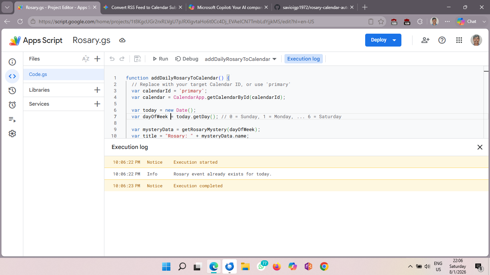

# rosary-calendar-automation-daily-sync
Automated Google Apps Script that fetches daily Rosary mysteries, creates calendar events with reminders, and avoids duplicate entries.
# 📿 Daily Catholic Rosary Calendar Sync 🗓️✨

An automated, lightweight **Google Apps Script** ⚙️ that determines today's Rosary mysteries, generates full descriptions for all 5 decades, and adds an event to your Google Calendar 📅—keeping your prayer life organized and on track! ✝️❤️

---

## 🌟 Awesome Features 🚀

* 📿 **Smart Mystery Detection:** Automatically assigns Joyful 😇, Sorrowful ✝️, Glorious 👑, or Luminous 💡 Mysteries based on the day of the week!
* 🛑 **Anti-Duplicate Shield:** Scans your calendar before adding an event so you never get double-booked! 🛡️
* ⏰ **Fixed Prayer Window:** Automatically schedules your prayer time for **8:00 PM – 9:00 PM** every evening 🌙.
* 📝 **Full Meditation Notes:** Detailed summaries of all 5 decades are pasted right into the event description 📖!
* ⚡ **Zero External Dependencies:** Built natively for Google Apps Script with zero setup friction! 🎯

---

## 📅 Weekly Mystery Schedule 🗓️

| Day 📆 | Mystery Set 📿 | Key Highlights ✨ |
| :--- | :--- | :--- |
| **Mon & Sat** 💛 | **Joyful Mysteries** 😇 | Annunciation 🕊️, Nativity 👶, Finding in the Temple 🏛️ |
| **Tue & Fri** ❤️ | **Sorrowful Mysteries** ✝️ | Agony in the Garden 🌿, Carrying the Cross ☦️, Crucifixion ✝️ |
| **Wed & Sun** 💙 | **Glorious Mysteries** 👑 | Resurrection 🌅, Pentecost 🔥, Coronation of Mary 👸 |
| **Thursday** 🤍 | **Luminous Mysteries** 💡 | Baptism in the Jordan 🌊, Wedding at Cana 🍷, Eucharist 🍞 |

---
### 📸 Successful Execution Log

## 🚀 Quick Setup Guide 🛠️

### Step 1: Open Google Apps Script 💻
1. Go to **[script.google.com](https://script.google.com)** 🌐.
2. Click **New Project** ➕.
3. Paste the code from `Rosary.gs` into the editor 📋.

### Step 2: Choose Your Calendar 🗓️
By default, the script adds events to your primary calendar:
```javascript
var calendarId = 'primary'; 💡

